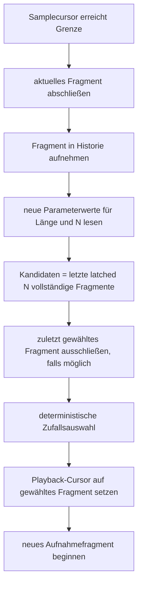
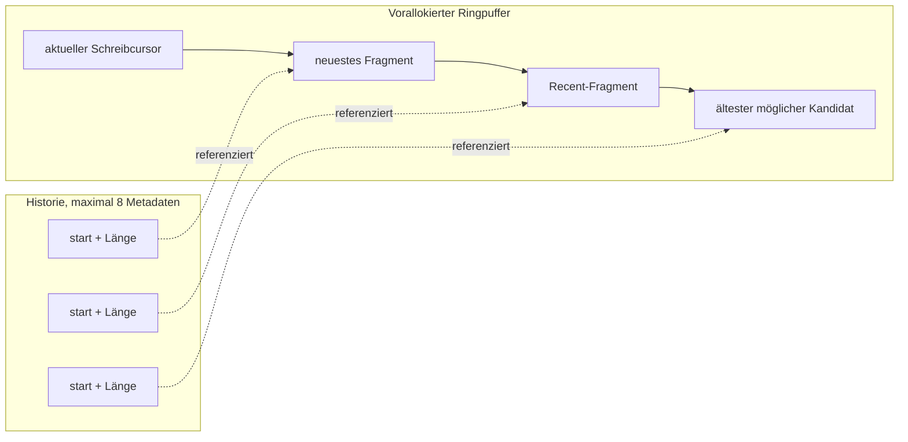
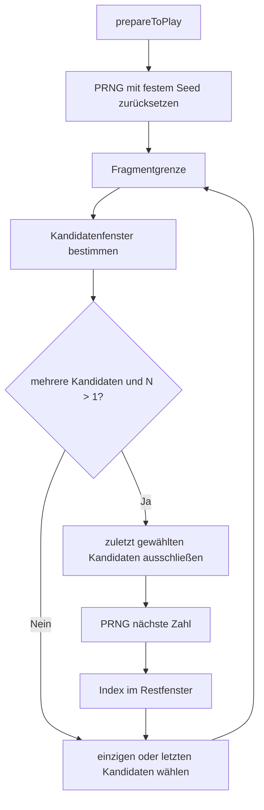
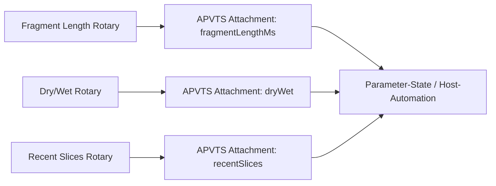

## Context

Der Prozessor verwendet einen samplecursorbasierten Stereo-Ringpuffer und verarbeitet Host-Blöcke sampleweise. Der MVP hält nur ein Recent-Fragment vor; `Fragment Length` wird bereits an Fragmentgrenzen gelatcht. Siehe `proposal.md` und die Delta-Spec für Motivation und beobachtbares Verhalten.

## Goals / Non-Goals

**Goals:**

- Bis zu acht vollständig aufgenommene Fragmente ohne Audio-Thread-Allokationen verwalten.
- Reproduzierbare Random-Recent-Auswahl an Fragmentgrenzen ermöglichen.
- N und Fragment Length mit identischer Grenzsemantik latched verarbeiten.
- Drei kompakte, sichtbar formatierte Rotary-Parameter anbieten.

**Non-Goals:**

- Host-Tempo-Sync, weitere Wiedergabemodi, Wiederholungszähler oder Audio-Persistenz.
- DAW-Smoke-Tests oder ein umfangreiches Redesign außerhalb der drei Regler.

## Decisions

### Parameter

| Parameter | Typ/Bereich | Default | Anzeige | Aktivierung |
|---|---:|---:|---|---|
| Fragment Length | Float, 20–2000 ms | 222 ms | `N ms` | nächste Grenze |
| Dry/Wet | Float, 0–1 | 100 % | `N %` | kontinuierliche Mischung wie bisher |
| Recent Slices N | Integer, 1–8 | 4 | `N` | nächste Grenze |

`Recent Slices N` wird als diskreter APVTS-Parameter angelegt. Die Oberfläche verwendet APVTS-Attachments; State bleibt die serialisierte APVTS-ValueTree. Fehlende N-Werte in älteren States fallen auf 4 zurück.

### Fragmentgrenze und Auswahl

Die Historie speichert pro Eintrag Startposition und Länge. Der gerade abgeschlossene Eintrag darf sofort Kandidat werden. Bei nur einem Kandidaten wird dieser verwendet; bei keiner Historie bleibt Wet stumm.

### Ringpuffer und Fragmenthistorie

Die Kapazität wird konservativ als `(8 + 1) * maxFragmentSamples + maximumBlockSize` dimensioniert. Dadurch können auch bei N=8 und maximalen oder unterschiedlichen Fragmentlängen laufende Wiedergaben aus dem Ringpuffer gelesen werden. Das Metadatenarray ist fest begrenzt; beim Überlauf fällt der älteste Eintrag aus dem Auswahlfenster.

### Deterministische Zufallsauswahl

Der PRNG darf nur an Fragmentgrenzen fortschreiten. Ein einfacher integerbasierter Generator ist gegenüber Systemzufall vorzuziehen, weil er ohne Locks, I/O und Allokationen arbeitet und blockgrößenunabhängig bleibt. Der Seed wird bei `prepareToPlay` reproduzierbar zurückgesetzt.

### UI-Layout und Parameterbindung

Die Oberfläche erhält ein kompaktes Dreispaltenlayout. Jeder Rotary-Slider hat ein Label und ein Textfeld unterhalb oder innerhalb des Reglers. Formatter liefern `ms`, `%` beziehungsweise eine Ganzzahl; die Darstellung darf keine eigene, vom APVTS abweichende Parameterquelle besitzen.

### Echtzeitsicherheit

Alle Historienarrays, PRNG-Zustände und Puffer werden in Konstruktion beziehungsweise `prepareToPlay` bereitgestellt. `processBlock` darf nur atomare Parameterwerte lesen, Integerarithmetik ausführen und vorhandene Puffer lesen/schreiben. Es darf keine `std::random`-Verteilung mit versteckter Synchronisation, keine Speicherverwaltung und keine UI-Kommunikation im Audiopfad geben.

## Risks / Trade-offs

- **[Ringpuffer zu klein]** → konservative Kapazität für 8+1 maximale Fragmentlängen und Blockreserve verwenden; N=8 gezielt testen.
- **[Zufall macht Tests flakey]** → festen PRNG-Seed und blockgrenzenunabhängige Auswahl verwenden.
- **[Parameteränderung mitten im Fragment erzeugt Sprung]** → N und Länge ausschließlich an der Fragmentgrenze latched übernehmen.
- **[Direkte Wiederholung trotz Vermeidung]** → nur ausschließen, wenn ein anderer Kandidat im aktiven Fenster existiert; N=1 und Einzelkandidat bleiben gültig.
- **[Alter State enthält N nicht]** → APVTS-Default 4 als Rückwärtskompatibilität verwenden.
- **[Größere Pufferkosten bei hohen Sampleraten]** → feste Maximalgrenze 8 und maximal 2000 ms beibehalten; Speicher nur in `prepareToPlay` dimensionieren.

## Migration Plan

1. Neue Parameterdefinition und Audiohistorie implementieren.
2. Bestehende State-Roundtrips um `recentSlices` erweitern; alte States mit Default 4 laden.
3. Rotary-Oberfläche und Unit-Tests ergänzen.
4. Build, Unit-Tests und Validierung ausführen.

Rollback ist durch Entfernen des Changes möglich; bestehende States ohne N bleiben kompatibel, solange der Parameter-Default 4 erhalten bleibt.
