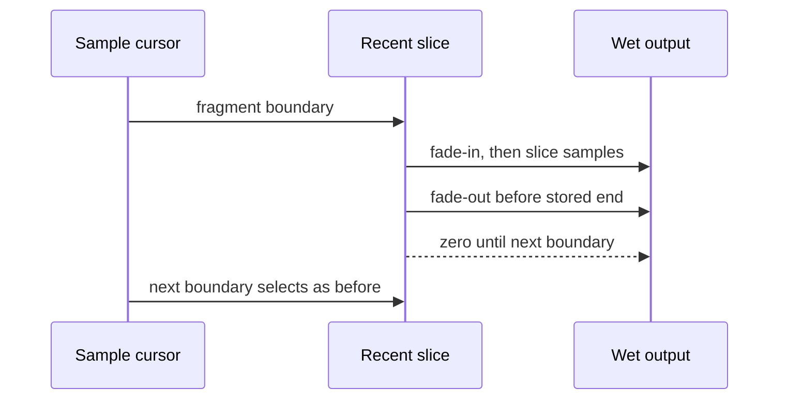

## Context

Der Prozessor verarbeitet Fragmente sampleweise und wählt sie an samplecursorbasierten Grenzen aus. Die bestehende Wet/Dry-Mischung und Random-Recent-Auswahl bleiben unverändert; die neue Hüllkurve wirkt ausschließlich auf das bereits gelesene Wet-Fragment.

## Goals / Non-Goals

**Goals:**

- Technische Sprünge an Anfang und Ende eines Wet-Fragments glätten.
- Eine kurze, sampleratenabhängige Half-Cosine-Hüllkurve ohne Latenz und ohne Audio-Thread-Allokationen anwenden.
- Kurze ausgewählte Fragmente vollständig kontrolliert ausblenden.
- Deterministische Verarbeitung unabhängig von Host-Blockgrößen bewahren.

**Non-Goals:**

- Keine Crossfade-Überblendung zwischen verschiedenen Slice-Inhalten.
- Keine Änderung an Fragmentlängen, Aufnahmegrenzen, Kandidatenfenster, PRNG oder Parametern.
- Keine zusätzliche Latenz und keine persistenten Hüllkurven-State-Daten.

## Decisions

### Samplebasierte Hüllkurve

Die nominale Fade-Länge wird bei `prepareToPlay` aus 5 ms und der Samplerate in Samples berechnet. Für jedes Fragment wird sie auf höchstens `fragmentLength / 8` begrenzt. Die Berechnung verwendet nur Integer-/Float-Arithmetik und wird für unterschiedliche Fragmentlängen aus den vorhandenen Fragmentmetadaten abgeleitet.

```mermaid
flowchart LR
    A[Fragment selected] --> B[Read stored fragment length]
    B --> C[fadeSamples = min(5 ms, length / 8)]
    C --> D[Apply fade-in to first samples]
    D --> E[Apply full Wet signal]
    E --> F[Apply fade-out to final samples]
    F --> G[Wet becomes zero before next boundary]
```

Die Hüllkurve verwendet eine Half-Cosine-Form: Fade-in `0.5 - 0.5*cos(pi*x)` und Fade-out `0.5 + 0.5*cos(pi*x)`, mit einem normalisierten Bereich `x` von 0 bis 1. Die exakte Endpunktbehandlung wird so gewählt, dass der erste Fade-Sample null und der letzte Wet-Sample des Fragments null ist.

### Kürzere Fragmente

Die Wiedergabelänge bleibt die gespeicherte Länge des ausgewählten Fragments. Wenn sie vor der nächsten Aufnahmegrenze endet, liefert der Wet-Pfad danach weiterhin null; der Fade-out liegt innerhalb der letzten `fadeSamples` des ausgewählten Fragments. Es wird kein zusätzlicher Puffer und keine Verzögerung eingeführt.



### Echtzeit- und Determinismusgrenzen

Alle Hüllkurvenzustände bleiben in vorab vorhandenen primitiven Feldern. `processBlock` darf keine Verteilung, Allokation, Sperre oder UI-Kommunikation verwenden. Der PRNG wird nicht von der Hüllkurve gelesen oder fortgeschrieben; dadurch bleibt die Auswahlfolge unverändert und blockgrößenunabhängig.

## Risks / Trade-offs

- **[Sehr kurze Fragmente haben kaum nutzbare Fade-Zeit]** → Begrenzung auf höchstens ein Achtel und deterministische Endpunktbehandlung beibehalten.
- **[Hüllkurve verändert bewusst die ersten und letzten Wet-Samples]** → Dry/Wet-Mischung und Fragmentgrenzen unverändert lassen; nur technische Klicks werden behandelt.
- **[Rundung bei unterschiedlichen Sampleraten]** → Fade-Längen einmal sampleratenabhängig berechnen und mit festen Grenzen clampen.
- **[Falsche Zustandskopplung könnte PRNG-Folge ändern]** → Hüllkurvenfortschritt strikt vom Auswahlzustand trennen.

## Migration Plan

1. Hüllkurvenberechnung und vorallokierte Zustände im Prozessor ergänzen.
2. Regressionstests für bestehende Parameter-, State-, Dry/Wet- und Random-Recent-Funktionalität ausführen.
3. Neue Fade-, Kurzfragment- und Blockgrößentests ausführen.

Rollback erfolgt durch Entfernen der Hüllkurvenmultiplikation und der zugehörigen Zustände; Parameter- und State-Formate bleiben unverändert.
