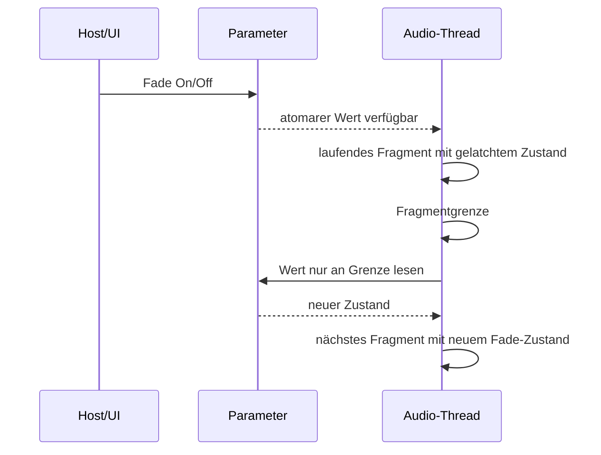

## Context

Der Prozessor verarbeitet Fragmente sampleweise, speichert die Fragmentlänge
des ausgewählten Recent-Slices und wendet die bestehende Half-Cosine-Hüllkurve
auf das Wet-Signal an. Parameteränderungen für Fragmentlänge und Recent-Fenster
werden bereits an samplecursorbasierten Fragmentgrenzen gelatcht. Der Fade-
Schalter muss dieselben Echtzeit- und Determinismusgrenzen einhalten.

## Goals / Non-Goals

**Goals:**

- Eine stabile, hostautomatisierbare Parameter-ID `fadeEnabled` mit Anzeige
  `Fade` und Default `true` ergänzen.
- Fade On/Off gemeinsam mit den anderen fragmentbezogenen Werten an der
  nächsten Fragmentgrenze übernehmen.
- Die Fade-Länge korrekt als `min(round(20 ms * sampleRate / 1000),
  floor(fragmentLengthSamples / 8))` bestimmen.
- Die vorhandene Auswahl-, PRNG-, Grenz- und Mischlogik unverändert lassen.

**Non-Goals:**

- Keine einstellbare Fade-Dauer.
- Kein Crossfade zwischen verschiedenen Fragmenten und keine zusätzliche
  Latenz.
- Keine Änderung bestehender Parameter-IDs oder des Recent-Auswahlalgorithmus.

## Decisions

### Parameter und Grenzsemantik

`fadeEnabled` wird als boolescher APVTS-Parameter angelegt. Im Prozessor wird
sein Wert bei `prepareToPlay` und an jeder Fragmentgrenze in ein primitives
Audio-Thread-Feld übernommen. Während eines Fragments wird dieses Feld nicht
erneut ausgelesen. Dadurch gilt die Änderung deterministisch ab genau der
nächsten Grenze und nicht mitten in einem Host-Block.



### Samplegenaue Hüllkurve

Die nominale Fade-Länge wird aus 20 ms und der aktiven Samplerate in Samples
berechnet. Die Begrenzung auf `floor(length / 8)` garantiert, dass die
Hüllkurve nie länger als ein Achtel des ausgewählten Fragments wird. Für null
oder ein nutzbares Fade-Sample wird der Gain als 1.0 behandelt; dabei darf die
Wiedergabe nicht auf ungültige Samplepositionen zugreifen.

Die bestehende Half-Cosine-Form bleibt erhalten. Der Fade wird nur auf das
bereits gelesene Wet-Fragment angewandt; Aufnahme, Auswahl und Dry-Signal
bleiben unabhängig davon.

### State-Migration

Beim Laden eines älteren ValueTree ohne `fadeEnabled` wird die fehlende
Eigenschaft vor dem State-Replacement mit `true` ergänzt. Dadurch entspricht
der Default dem bisherigen geglätteten Verhalten. Die bestehende
Fallback-Behandlung für `recentSlices` bleibt erhalten.

### UI-Anordnung

Die bestehende Drei-Spalten-Ansicht wird um eine vierte Spalte erweitert:

```text
Fragment Length | Dry/Wet | Recent Slices N | Fade [On/Off]
```

Für den Toggle wird die APVTS-Button-Bindung verwendet. Die Beschriftung
`Fade` wird bevorzugt, weil sie die konkrete Hüllkurve beschreibt; `Smooth`
würde die Funktion semantisch breiter und ungenauer erscheinen lassen.

## Risks / Trade-offs

- [Sample-Rundung verhindert exakt 2,5 ms bei jeder Samplerate] → Samplewerte
  deterministisch runden und Tests mit Toleranz beziehungsweise exakten
  Samplegrenzen definieren.
- [Fade Off kann Klicks erzeugen] → Dieses Verhalten ist ausdrücklich als
  kreativer Glitch-Modus spezifiziert.
- [State-Migration könnte bei falscher Property-Struktur scheitern] → Einen
  expliziten Test mit einem State ohne `fadeEnabled` ergänzen.
- [Parameteränderung könnte versehentlich die PRNG-Folge beeinflussen] → Fade
  ausschließlich an der Grenze latchen und niemals `nextRandom()` berühren.

## Migration Plan

1. Parameterlayout, Prozessor-Latch und Hüllkurvenberechnung ergänzen.
2. State-Fallback für fehlendes `fadeEnabled` ergänzen.
3. Toggle-UI und Parameterbindung ergänzen.
4. Bestehende und neue deterministische Unit-Tests ausführen.

Rollback erfolgt durch Entfernen des Fade-Parameters und der Hüllkurvensteuerung;
die bestehenden Parameter-IDs bleiben dabei unverändert.
