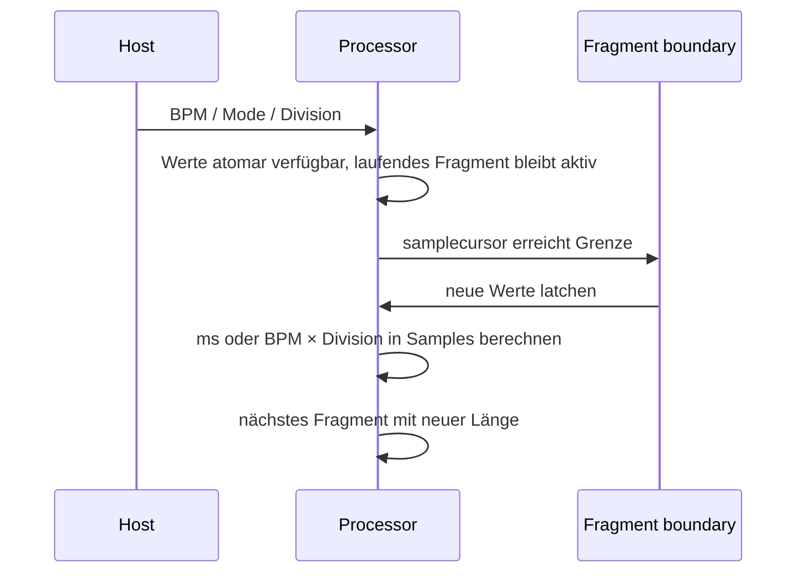

## Context

Die Fragmentlänge wird aktuell über `fragmentLengthMs` als Millisekundenwert
berechnet und an Fragmentgrenzen übernommen. Die Oberfläche verwendet dafür
einen Drehregler. Random-Recent, Fade, Dry/Wet, samplecursorbasierte Grenzen
und der allocation-freie Audio-Thread müssen unverändert funktionieren.

## Goals / Non-Goals

**Goals:**

- Einen kompatiblen `Milliseconds`-Modus und einen `Tempo Sync`-Modus ergänzen.
- Millisekunden- und Notenwertsteuerung als zwei getrennte, speicherbare Werte
  modellieren.
- Den jeweils nicht aktiven Regler sichtbar, aber disabled darstellen.
- Tempoabhängige Samplezahlen deterministisch an Fragmentgrenzen latchen.

**Non-Goals:**

- Keine Änderung an Fragmentauswahl, PRNG, Fade oder Dry/Wet.
- Keine kontinuierliche Swing-, Shuffle- oder Host-Transport-Synchronisation.
- Keine 1/32-Division.
- Keine Umrechnung des gespeicherten Millisekundenwerts in einen Notenwert oder
  umgekehrt beim Moduswechsel.

## Decisions

### Getrennte Parameter statt eines mehrdeutigen Reglers

`fragmentLengthMs` bleibt als bestehender Parameter erhalten. Ergänzt werden
`sliceLengthMode` als Choice-Parameter und `syncDivision` als Choice-Parameter.
Das vermeidet eine kontextabhängige Bedeutung desselben Host-Parameterwerts,
erhält alte Automation und ermöglicht, den inaktiven Regler zuverlässig zu
deaktivieren. Ein einzelner physischer Regler mit wechselnder Semantik wäre
kompakter, aber für Host-Automation und State schwerer eindeutig zu machen.

### Divisionstabelle

Die Choice-Tabelle enthält für die Basiswerte 1/1, 1/2, 1/4, 1/8 und 1/16
jeweils gerade, punktierte und triolische Einträge. Intern werden Faktoren
verwendet: gerade `1.0`, punktiert `1.5`, triolisch `2.0 / 3.0`. Die UI zeigt
kurze eindeutige Labels wie `1/4`, `1/4 D` und `1/4 T`.

### Host-BPM und Grenzsemantik

Der Prozessor liest einen gültigen BPM-Wert aus der Host-Position. Ein
vorallokiertes primitives Feld hält den letzten gültigen BPM-Wert; es startet
mit 120 BPM. Modus, Division und BPM werden nur an Fragmentgrenzen in den
aktiven Längenzustand übernommen. Dadurch ändert ein Host-Tempo-Event kein
laufendes Fragment.



Wenn der Host kein gültiges BPM liefert, bleibt der letzte gültige Wert aktiv;
vor dem ersten gültigen Wert wird 120 BPM verwendet. Die Berechnung lautet
`seconds = (60 / bpm) * beatFactor`, danach folgt die Sample-Rundung.

### UI-Aktivierung

Die beiden Drehregler bleiben gleichzeitig sichtbar. Der Moduswähler steuert
ihre `enabled`-Eigenschaft:

```text
Mode: [ Milliseconds ]
Fragment Length: 222 ms       Tempo Division: disabled

Mode: [ Tempo Sync ]
Fragment Length: disabled      Tempo Division: 1/4
```

Die Parameterattachments bleiben an ihren jeweiligen Bedienelementen. Die UI
reagiert auf Mode-Änderungen sowohl aus dem Host als auch aus der Oberfläche.

### State-Migration

States ohne `sliceLengthMode` werden als `Milliseconds` behandelt. States ohne
`syncDivision` erhalten den definierten Default `1/4`; `fragmentLengthMs` und
alle bestehenden Parameter bleiben unverändert.

## Risks / Trade-offs

- [Host liefert kein oder wechselndes BPM] → letzten gültigen BPM-Wert und
  initial 120 BPM verwenden; Änderungen nur an Fragmentgrenzen übernehmen.
- [Choice-Parameter sind für Hosts weniger frei als ein Float] → begrenzte,
  musikalisch verständliche Divisionstabelle zugunsten eindeutiger Automation.
- [Zwei Regler benötigen mehr UI-Platz] → vorhandene kompakte Ansicht um eine
  Mode-Zeile und den zweiten Längenregler erweitern.
- [Dotted/Triplet-Labels können missverständlich sein] → `D` und `T` in der
  UI verwenden und die vollständige Bedeutung in Stringdarstellungen testen.

## Migration Plan

1. Choice-Parameter, State-Fallbacks und tempoabhängige Sampleberechnung
   ergänzen.
2. Fragmentgrenzen-Latch um Modus, Division und BPM erweitern.
3. Zwei Längenregler und Mode-Steuerung in der UI anbinden.
4. State-, Tempo-, Grenz-, UI- und Regressionstests ausführen.

Rollback entfernt Mode und Sync-Parameter; alte Millisekundenwerte bleiben als
`fragmentLengthMs` erhalten.
